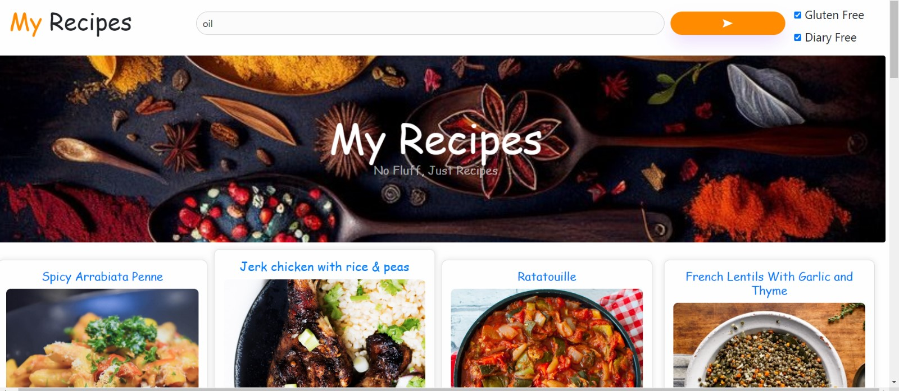

##   My Recipes App 🍴
This project involves creating a server that interacts with a [Recipe API](https://recipes-goodness-elevation.herokuapp.com/) to retrieve recipes containing a specific ingredient. The server will have a dedicated route to fetch and display recipes based on user input.


## Install Dependencies:
1. ```npm install```
2.  ``` npm install express axios ```
**The server will be accessible at: http://localhost:5003 by default.**

## Screenshot

